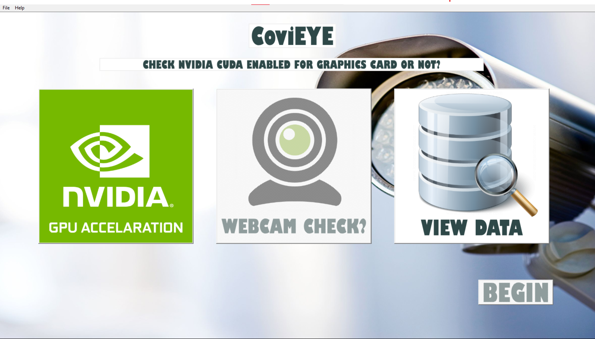
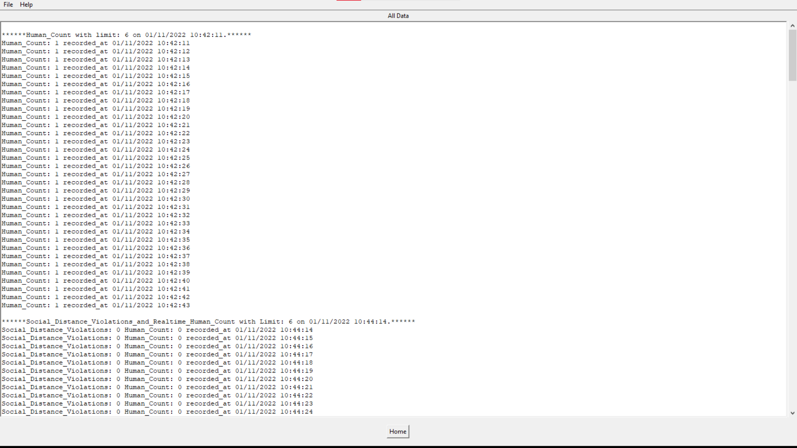
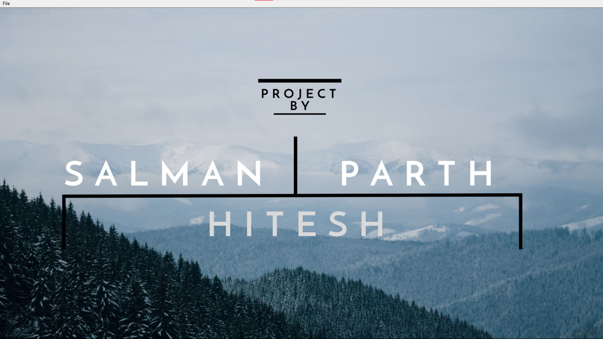
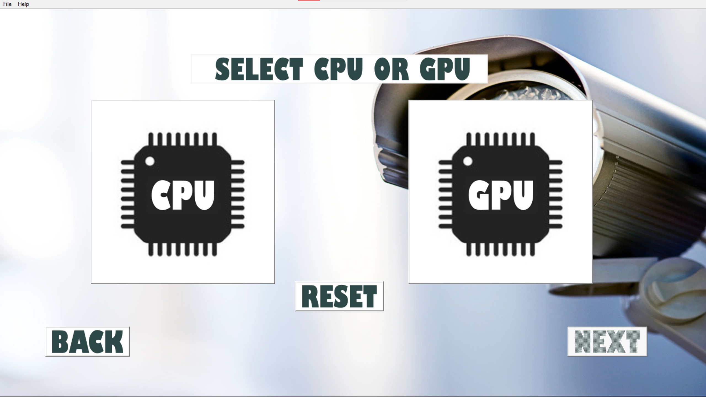
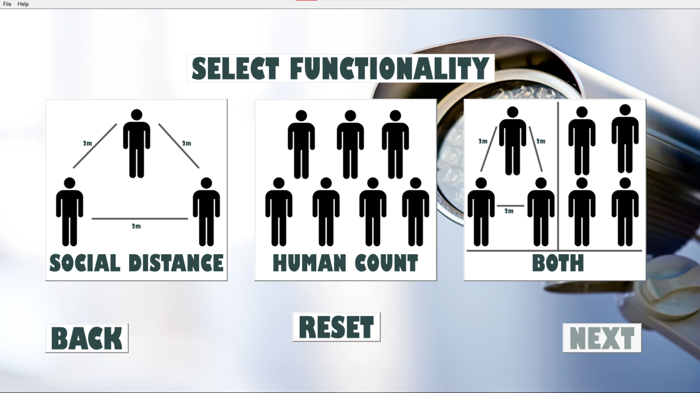
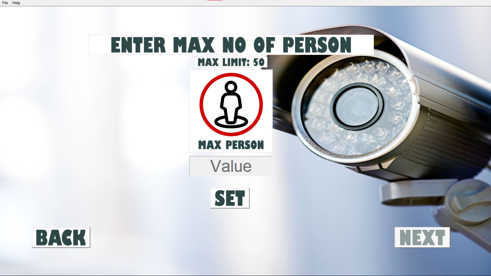
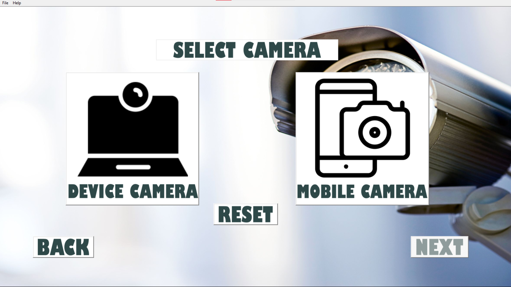
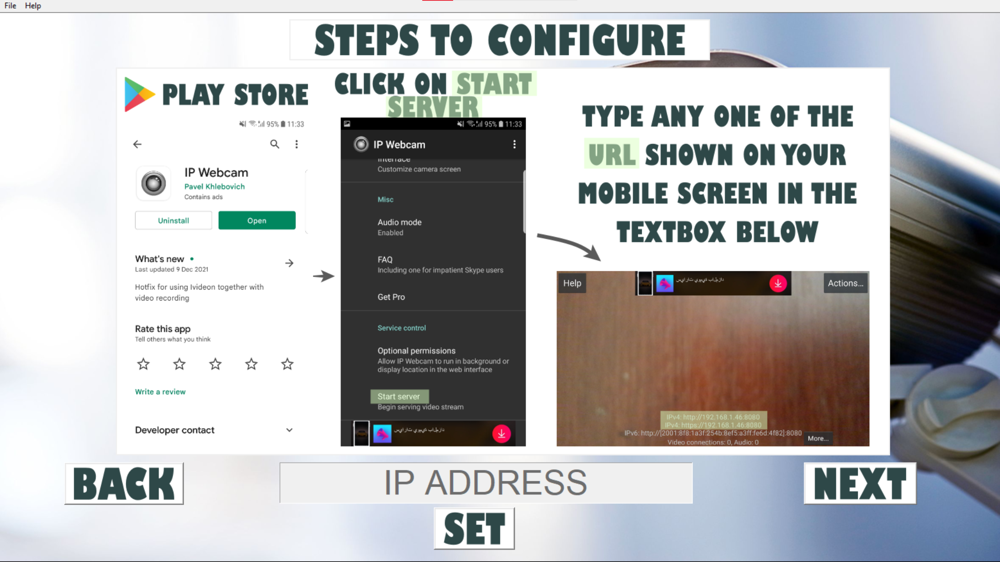
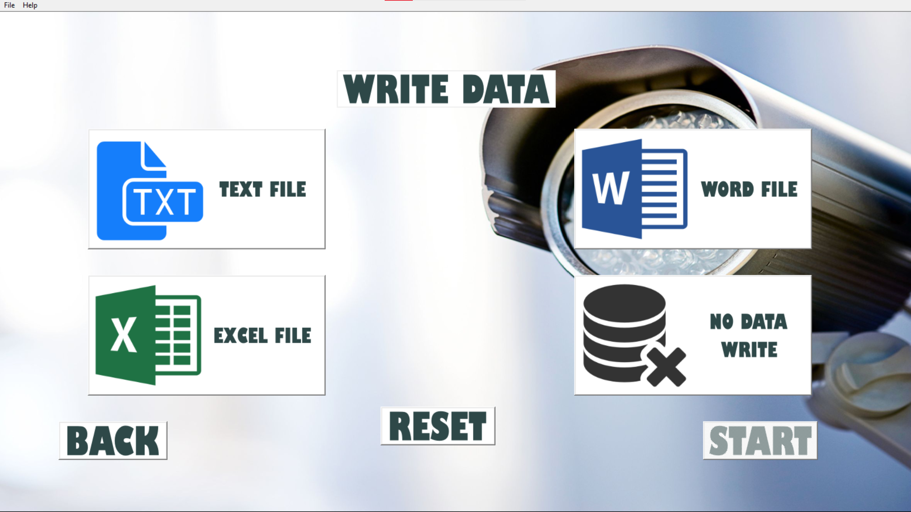

# Realtime-Social-Distance-Detection-with-GUI-in-Python

## About the Project

This project is about Social Distance Detection and Human count. Entire project is made using python. We have made use of a YOLOv3 pre-trained model. It is a complete desktop application made using python Tkinter.

    <b>Home Screen</b>

    <b>View Data</b>

    <b>PDF Convert</b>

    <b>Credits Page</b>

    <b>Processor Selection Page</b>

    <b>Functionality Selection Page</b>

    <b>Human Count</b>

    <b>Camera Selection</b>

    <b>IP Webcam Configure</b>

    <b>Write Data Screen</b>

## Installation

You need to have anaconda installed.
You need to install all the python libraries.

## Technologies Used

1. Python
2. OpenCV
3. Python Tkinter

## System Requirements

Minimum Requirements

8Gb RAM
Intel i5 processor
Hard disk 1Tb 
Optional: Graphic Card 

## Download YOLO COCO 

Download the folder in the link and paste in the project directory.
https://drive.google.com/drive/folders/11IHXeWxC4o3ZDG_DcFfYSAn5BLHrbDQa?usp=sharing
